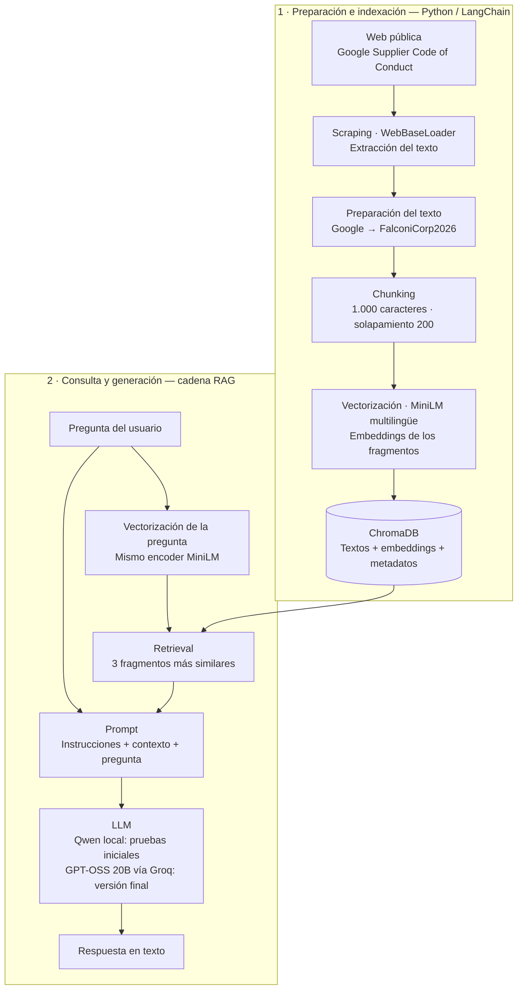

# 📚 RAG — Google Supplier Code of Conduct

Proyecto académico de **Retrieval-Augmented Generation (RAG)** con Python, LangChain y ChromaDB. Explora cómo responder preguntas utilizando como contexto el Código de Conducta para Proveedores de Google, disponible públicamente en español.

El notebook conserva las pruebas y sus resultados, desde la recuperación de documentos hasta la generación con un modelo local y posteriormente mediante API.

---

## 🎯 Objetivo

Construir un flujo RAG completo y comprender sus componentes: carga de documentos, fragmentación, embeddings, búsqueda vectorial y generación de respuestas apoyadas en el contexto recuperado.

Como ejercicio, se sustituye el nombre «Google» por la empresa ficticia **FalconiCorp2026** dentro del texto procesado. Esta modificación permite explorar el uso del contexto, aunque por sí sola no demuestra que todas las respuestas estén fundamentadas correctamente.

## ⚡ Flujo

Los embeddings se generan en el runtime de Colab y ChromaDB mantiene el índice durante la sesión. En la versión final, la pregunta y el contexto recuperado se envían al LLM mediante la API de Groq.

## 🛠️ Tecnologías y decisiones

| Componente | Implementación | Propósito |
|---|---|---|
| Entorno | Python / Google Colab | Desarrollar e inspeccionar el proceso por celdas. |
| Carga documental | `WebBaseLoader` | Extraer el contenido de la página pública. |
| Fragmentación | `RecursiveCharacterTextSplitter` | Fragmentos de hasta 1.000 caracteres, con solapamiento configurado de 200. |
| Embeddings | `paraphrase-multilingual-MiniLM-L12-v2` | Generar representaciones multilingües localmente para consultar documentos en español. |
| Base vectorial | ChromaDB | Indexar los fragmentos y recuperar los más similares a la pregunta. |
| Orquestación | LangChain | Conectar recuperación, prompt, modelo y salida de texto. |
| Primera prueba de generación | `Qwen/Qwen2.5-0.5B-Instruct` | Experimentar con un modelo pequeño ejecutado en el runtime de Colab. |
| Generación mediante API | `openai/gpt-oss-20b`, servido por Groq | Probar una alternativa tras observar respuestas insuficientes con la configuración local. |

## 🔎 Qué muestra el notebook

- Carga e inspección del documento.
- Fragmentación e indexación en ChromaDB.
- Consulta de los fragmentos recuperados y sus puntuaciones.
- Construcción de una cadena RAG con LangChain.
- Pruebas con Qwen local y ajustes de generación.
- Integración de GPT-OSS 20B mediante Groq.
- Consulta de ejemplo sobre el horario laboral.

En la prueba guardada, la respuesta obtenida mediante Groq recoge información relevante del fragmento sobre horario laboral. Se trata de una observación puntual, no de una evaluación comparativa formal de los modelos.

## 🚀 Ejecución

1. Abrir el notebook en Google Colab.
2. Instalar las dependencias indicadas en sus celdas. Si `langchain_chroma` no está disponible, instalar también `langchain-chroma`.
3. Para las celdas de Groq, crear un secreto de Colab llamado `GroqTestKey` y permitir su acceso desde el notebook.
4. Ejecutar las celdas en orden y revisar los fragmentos recuperados antes de interpretar la respuesta final.

La primera carga de los modelos requiere descargarlos. La etapa de Groq necesita una cuenta y una clave propia, y está sujeta a las condiciones y límites del proveedor.

La pregunta y los fragmentos incluidos en el prompt se envían a Groq durante esa etapa. No deben utilizarse documentos confidenciales sin la autorización correspondiente.

## 📌 Alcance

Práctica exploratoria sobre una fuente documental pública. No incluye interfaz web, autenticación de usuarios, evaluación automatizada ni despliegue en producción.

El índice se crea durante la sesión, sin configurar persistencia en disco. Las dependencias no están fijadas a versiones concretas, por lo que pueden requerir ajustes al reproducir el ejercicio.

Las respuestas pueden contener errores u omisiones y deben contrastarse con el documento original. El proyecto no está afiliado a Google ni representa una interpretación oficial de sus políticas.

## 📖 Fuentes

- [Código de Conducta para Proveedores de Google](https://about.google/intl/es_ALL/company-info/supplier-code-of-conduct/).
- [Tutorial de referencia — Keerti Purswani / Educosys](https://www.youtube.com/watch?v=wzssm02u35I).

---

Carlos Falconi · Práctica académica de RAG.
